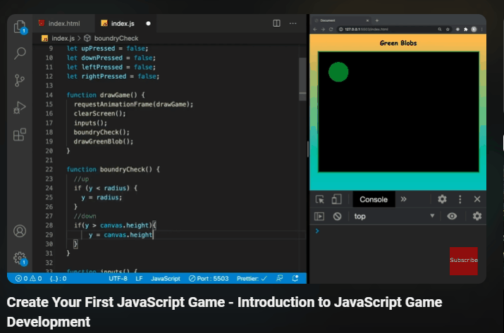

# Jogo de Controle de Círculo no Canvas HTML 🔴
Este é um jogo simples de controle de círculo implementado em JavaScript com o uso de um elemento <'canvas'> HTML. O jogador pode movimentar um círculo pelo canvas usando as teclas de seta (cima, baixo, esquerda, direita) e o círculo muda de cor quando está em movimento.

## Como Jogar
1. Abra o arquivo index.html em um navegador da web que suporte HTML5.

2. Use as teclas de seta para movimentar o círculo pelo canvas.

3. O círculo muda para uma cor específica quando atinge as bordas do canvas.

## Estrutura do Código
- index.html: Contém o markup HTML básico e inclui o script JavaScript.

- styles.css: Arquivo de estilo básico para configurar o tamanho do canvas e o fundo. Por se tratar de um código simples, optei pelo CSS interno.

- script.js: O código JavaScript que controla o movimento do círculo, verifica os limites do canvas e altera a cor conforme necessário.

## Como Funciona

1. O código utiliza o elemento <'canvas'> para criar a área de jogo.

2. O círculo é desenhado no contexto 2D do canvas usando as funções arc() e fill() do JavaScript.

3. O jogador controla o círculo com as teclas de seta.

4. A cor do círculo muda quando ele atinge as bordas do canvas.

## Personalização
Sinta-se à vontade para ajustar as variáveis no arquivo script.js para experimentar diferentes velocidades, tamanhos de círculo ou cores.

## Créditos
O projeto foi originalmente criado pelo canal <strong>Coding With Adam</strong>, do Youtube, utilizado por mim como base de aprendizado e treinamento. Divulgado em 2020, o projeto original continha alguns elementos ultrapassados, então tomei a liberdade de atualizá-lo para deixar o código mais próximo do padrão semântico atual. Além disso, decidi fazer algumas mudanças visuais e no comportamento do elemento de jogo. O canal pode ser visualizado e visitado logo abaixo.

## Tecnologias Utilizadas
-  HTML5
-  CSS3 
-  JavaScript (ES6+)
